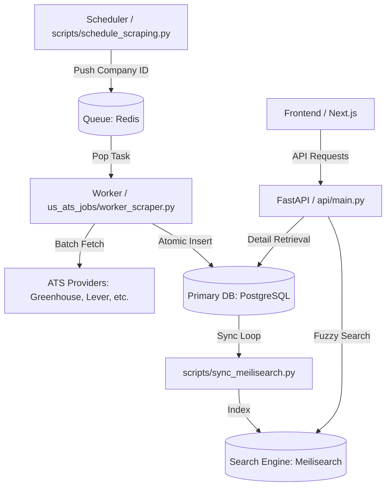

# 🏗️ System Architecture & Technical Documentation

## Overview

This document provides a **senior-level technical breakdown** of the job board's architecture, data flow, and operational workflows.

---

## 📊 System Architecture (v2 - Scalable)

### High-Level Design

Your job board now uses a **distributed, high-concurrency architecture** designed for 1M+ jobs.



### Infrastructure Layer
- **PostgreSQL**: Row-level locking and ACID compliance for multi-worker parallel writes.
- **Redis**: Low-latency task queue for distributed ingestion.
- **Meilisearch**: Typo-tolerant, ultra-fast full-text search engine (<50ms).
                             │
                             ▼
┌─────────────────────────────────────────────────────────┐
│                    JOBS DATABASE                        │
├─────────────────────────────────────────────────────────┤
│  jobs table with intelligence layer                    │
│  - job_id, title, company, location                    │
│  - job_description, job_link, source                   │
│  - Intelligence fields (salary, visa, work_mode, etc)  │
└─────────────────────────────────────────────────────────┘
```

---

## 🔄 Data Flow & Source of Truth

### Critical Understanding

**The Database is the Single Source of Truth**

```
companies.json / config.py  →  Database (companies table)  →  main.py (Job Fetcher)
         ↓                              ↓                            ↓
   [Initial Load]              [Persistent Storage]          [Runtime Queries]
```

**Key Point:** Once companies are in the database, `main.py` **ONLY** reads from the database. The JSON/config files are **ingestion mechanisms**, not runtime dependencies.

---

## 🚪 Three Data Ingestion Pathways

### 1. Config File Method (Legacy/Manual)

**Files:** `add_workable_batch.py`, `add_workday_batch.py`, `add_workday_massive.py`

**Purpose:** Quick manual addition of companies

**How it works:**
```python
# config.py
WORKABLE_COMPANIES = ["canva", "hubspot"]
WORKDAY_COMPANIES = [{"name": "NVIDIA", "slug": "nvidia"}]

# Run batch script
python add_workable_batch.py
```

**Execution Flow:**
1. Reads company list from `config.py`
2. For each company: `database.add_company(name, ats_url, provider)`
3. Inserts into database with unique constraint on `ats_url`

**When to use:**
- ✅ Quick testing with 2-5 companies
- ✅ Manual verification of specific ATS
- ❌ Not recommended for bulk imports

**Status:** Still functional but superseded by JSON import

---

### 2. JSON Import Method (Bulk Import) ⭐ PRIMARY

**Files:** `import_from_json.py`, `companies.json`

**Purpose:** Bulk import of thousands of companies

**JSON Format:**
```json
{
  "greenhouse": ["company1", "company2"],
  "lever": ["company3", "company4"],
  "ashby": ["company5"],
  "workable": ["company6"],
  "bamboohr": ["company7"]
}
```

**Execution Flow:**
```python
# Run: python import_from_json.py
1. json.load('companies.json')
2. For each ATS provider:
   - Construct ats_url from template
   - database.add_company(name, ats_url, provider)
   - INSERT INTO companies VALUES (...)
3. Returns summary statistics
```

**Key Features:**
- **Idempotent** - Can run multiple times safely (skips duplicates)
- **Bulk processing** - Handles thousands of companies efficiently
- **Validation** - Checks JSON syntax before import
- **Reporting** - Provides detailed success/skip statistics

**ATS URL Templates:**
```python
{
    "greenhouse": "https://boards-api.greenhouse.io/v1/boards/{slug}/jobs",
    "lever": "https://api.lever.co/v3/postings/{slug}",
    "ashby": "https://api.ashbyhq.com/posting-api/job-board/{slug}",
    "workable": "https://apply.workable.com/api/v1/widget/accounts/{slug}",
    "bamboohr": "https://{slug}.bamboohr.com/jobs"
}
```

**Important:** After import, `companies.json` is **NOT** referenced by `main.py`

---

### 3. Discovery Method (Automated) 🤖

**Files:** `discover_companies.py`, `bulk_discover.py`

**Purpose:** Automatically discover which ATS a company uses

**How it works:**
```python
discover_and_save("Stripe")
```

**Discovery Process:**
1. **Google Search:** `"{company_name} careers"`
2. **ATS Detection:** Scrapes career page for ATS links
3. **URL Validation:** HTTP 200 = valid, 404 = invalid
4. **Database Insert:** Direct insert into companies table

**Supported ATS Detection:**
```python
ATS_DOMAINS = {
    "boards.greenhouse.io": "greenhouse",
    "jobs.lever.co": "lever",
    "jobs.ashbyhq.com": "ashby",
    "apply.workable.com": "workable",
    "bamboohr.com/jobs": "bamboohr"
}
```

**Fallback:** If search fails, tries standard slug patterns:
```python
guesses = [
    (f"https://boards.greenhouse.io/{slug}", "greenhouse"),
    (f"https://jobs.lever.co/{slug}", "lever"),
    (f"https://jobs.ashbyhq.com/{slug}", "ashby"),
    (f"https://{slug}.bamboohr.com/jobs", "bamboohr")
]
```

**Built-in Feeder System:**

`main.py` includes an **automated discovery feeder** (lines 216-227):
```python
# When JSearch finds a new company
employer = job.get("employer_name")
if employer.lower() not in known_companies:
    discover_and_save(cleaned_name)  # Auto-discovers!
```

---

## 🎯 Runtime Execution: How `main.py` Works

### Step-by-Step Execution Flow

#### **Step 1: Query Database (NOT config files)**

```python
# main.py line 158
active_companies = database.get_active_companies()
```

**SQL Executed:**
```sql
SELECT * FROM companies 
WHERE active = 1 
  AND (circuit_open_until IS NULL 
       OR circuit_open_until <= datetime('now'))
```

**Returns:** List of dictionaries:
```python
[
    {
        'id': 1,
        'name': 'stripe',
        'ats_url': 'https://boards-api.greenhouse.io/v1/boards/stripe/jobs',
        'ats_provider': 'greenhouse',
        'domain': 'stripe.com',
        'active': 1,
        'consecutive_failures': 0,
        ...
    },
    ...
]
```

**No reference to `companies.json` or `config.py` at this point!**

#### **Step 2: Apply Feature Flags**

```python
# main.py lines 162-166
if not ENABLE_LINKED_WORKDAY:
    workday_count = sum(1 for c in active_companies 
                        if c.get('ats_provider') == 'workday')
    active_companies = [c for c in active_companies 
                        if c.get('ats_provider') != 'workday']
    print(f"🚫 Skipping {workday_count} Workday companies")
```

**Purpose:** Runtime control to disable specific ATS providers

#### **Step 3: Circuit Breaker Filtering**

Companies with `circuit_open_until > NOW` are **automatically excluded** in Step 1.

**Circuit Breaker Logic:**
```python
def record_company_failure(company_id):
    failures = get_consecutive_failures(company_id)
    if failures >= 3:
        circuit_open_until = now + timedelta(days=7)
        # Company won't be fetched for 7 days
```

**Prevents:** Wasting API calls on broken companies

#### **Step 4: Parallel Job Fetching**

```python
# main.py lines 169-184
with ThreadPoolExecutor(max_workers=MAX_WORKERS) as executor:
    future_to_company = {
        executor.submit(fetch_company_jobs, company): company 
        for company in active_companies
    }
    
    for future in as_completed(future_to_company):
        jobs_list, name, provider, success = future.result()
        
        with jobs_lock:
            all_jobs.extend(jobs_list)
            source_counts[provider] += len(jobs_list)
```

**Worker Function:**
```python
def fetch_company_jobs(company_data):
    provider = company_data["ats_provider"]
    
    if provider == "greenhouse":
        jobs = fetch_greenhouse_jobs(name)
        for job in jobs:
            jobs_list.append(normalize_greenhouse(job, name))
            
    elif provider == "bamboohr":
        jobs = fetch_bamboohr_jobs(name)
        for job in jobs:
            jobs_list.append(normalize_bamboohr(job, name))
    
    # ... other providers
    
    if success:
        database.record_company_success(company_id)
    else:
        database.record_company_failure(company_id)
```

#### **Step 5: Normalization & Intelligence**

```python
# Normalizer example
def normalize_greenhouse(job, company):
    return {
        "job_id": f"greenhouse_{job.get('id')}",
        "title": job.get("title"),
        "company": company,
        "location": job.get("location", {}).get("name"),
        "job_description": job.get("content"),
        "job_link": job.get("absolute_url"),
        "source": "greenhouse",
        "date_posted": None
    }
```

**Intelligence Layer Applied:**
```python
# database.py insert_jobs()
for job in jobs:
    # Infer work mode
    work_mode = infer_work_mode(location, description)
    
    # Extract salary
    salary_min, salary_max, currency = extract_salary(description)
    
    # Infer visa sponsorship
    visa_sponsorship, confidence = infer_visa(description)
    
    # Normalize location
    loc_data = normalize_location(location)
```

#### **Step 6: Database Insert**

```python
# Inserts with all derived intelligence fields
INSERT INTO jobs (
    job_id, title, company, location, job_description,
    job_link, source, date_posted,
    work_mode, is_remote, seniority, department,
    salary_min, salary_max, salary_currency,
    visa_sponsorship, visa_confidence,
    normalized_location, city, state, country,
    posted_bucket, ingested_at
) VALUES (...)
```

---

## 🗄️ Database Schema

### Companies Table

```sql
CREATE TABLE companies (
    id INTEGER PRIMARY KEY AUTOINCREMENT,
    name TEXT NOT NULL,
    domain TEXT,
    career_page_url TEXT,
    ats_url TEXT UNIQUE,              -- Prevents duplicate companies
    ats_provider TEXT,                -- greenhouse/lever/ashby/workable/bamboohr
    active BOOLEAN DEFAULT 1,         -- Feature flag per company
    last_scraped_at TEXT,
    created_at TEXT DEFAULT CURRENT_TIMESTAMP,
    
    -- Circuit Breaker Fields
    consecutive_failures INTEGER DEFAULT 0,
    last_failure_at TEXT,
    circuit_open_until TEXT,          -- Auto-retry after this time
    last_success_at TEXT
)
```

**Unique Constraint:** `ats_url` ensures no duplicate companies

**Circuit Breaker:** After 3 failures → 7-day cooldown

### Jobs Table

```sql
CREATE TABLE jobs (
    job_id TEXT PRIMARY KEY,
    title TEXT,
    company TEXT,
    location TEXT,
    job_description TEXT,
    job_link TEXT,
    source TEXT,
    date_posted TEXT,
    
    -- Intelligence Layer
    work_mode TEXT,                   -- remote/hybrid/onsite
    is_remote INTEGER,
    seniority TEXT,                   -- entry/mid/senior/staff/principal
    department TEXT,                  -- engineering/sales/etc
    
    -- Salary Intelligence
    salary_min REAL,
    salary_max REAL,
    salary_currency TEXT,
    
    -- Visa Intelligence
    visa_sponsorship TEXT,            -- yes/no/maybe
    visa_confidence REAL,
    
    -- Location Intelligence
    normalized_location TEXT,
    city TEXT,
    state TEXT,
    country TEXT,
    
    -- Metadata
    posted_bucket TEXT,               -- today/week/month
    ingested_at DATE
)
```

---

## ⚡ Performance Considerations

### Current Scale

**Database Stats:**
- **Companies:** 8,796 active companies
- **Jobs per run:** ~10,000-15,000 jobs
- **ATS Distribution:**
  - Greenhouse: 4,516 companies
  - BambooHR: 2,519 companies
  - Lever: 952 companies
  - Ashby: 807 companies
  - Workable: 2 companies

### Runtime Estimation

**With Current Settings:**
```
MAX_WORKERS = 10
8,796 companies ÷ 10 workers = ~880 batches
Average fetch time: 2-5 seconds per company
Total runtime: ~3-7 hours
```

### Optimization Strategies

#### 1. Increase Parallelism

```python
# config.py
MAX_WORKERS = 20  # Default: 10
```

**Impact:** 2x faster (3.5 hours → 1.75 hours)

**Risk:** Higher rate limiting likelihood

#### 2. Selective Fetching

```python
# Disable specific ATS providers
ENABLE_LINKED_WORKDAY = False  # Already done
ENABLE_ATS = True  # Master switch
```

#### 3. Circuit Breaker Benefits

**Automatic optimization:**
- Failed companies skip for 7 days
- Reduces wasted API calls
- Self-healing system

**Monitor with:**
```bash
python show_cb_status.py
```

#### 4. Database Indexing

**Already implemented:**
```sql
CREATE UNIQUE INDEX idx_ats_url ON companies(ats_url);
CREATE INDEX idx_active ON companies(active);
CREATE INDEX idx_circuit ON companies(circuit_open_until);
```

---

## 📋 Configuration Reference

### Feature Flags

```python
# config.py

# Master switches
ENABLE_ATS = True              # All ATS providers
ENABLE_JSEARCH = True          # JSearch API
ENABLE_LINKEDIN = True         # LinkedIn API
ENABLE_LINK_USAJOBS = True     # USAJobs API

# ATS-specific
ENABLE_LINKED_WORKDAY = False  # Workday disabled (unstable)

# Pagination
JSEARCH_PAGES = 4
LINKEDIN_PAGES = 2
USAJOBS_PAGES = 3

# Performance
MAX_WORKERS = 10               # Parallel threads
```

### ATS Provider Status

| Provider | Status | Companies | Notes |
|----------|--------|-----------|-------|
| Greenhouse | ✅ Active | 4,516 | Stable API |
| BambooHR | ✅ Active | 2,519 | Newly added |
| Lever | ✅ Active | 952 | Stable API |
| Ashby | ✅ Active | 807 | Stable API |
| Workable | ✅ Active | 2 | Limited companies |
| Workday | ❌ Disabled | 0 | 400/422 errors |

---

## 🚀 Operational Workflows

### Daily Production Workflow

```bash
# 1. Fetch jobs from all active companies
python us_ats_jobs/main.py

# 2. Check circuit breaker status
python show_cb_status.py

# 3. View database stats
python diag_db.py
```

### Adding New Companies

**Option A: Bulk JSON Import (Recommended)**
```bash
# 1. Edit companies.json
# 2. Import to database
python import_from_json.py

# 3. Verify
python diag_db.py
```

**Option B: Automated Discovery**
```bash
# Discover 50+ companies automatically
python bulk_discover.py
```

**Option C: Single Discovery**
```bash
python us_ats_jobs/scripts/discover_companies.py "Stripe" "Netflix"
```

### Monitoring & Health

```bash
# Circuit breaker status
python show_cb_status.py

# Intelligence verification
python check_intelligence.py

# Database diagnostics
python diag_db.py

# Location verification
python verify_location.py

# Work mode verification
python verify_work_mode.py
```

---

## 🔧 Troubleshooting

### Common Issues

#### 1. JSON Import Fails

**Error:** `Expecting ',' delimiter`

**Solution:**
```bash
# Validate JSON
python -m json.tool companies.json
```

**Fix:** Missing comma between array elements

#### 2. No Companies Fetched

**Cause:** Circuit breakers open

**Solution:**
```bash
python show_cb_status.py
# Reset circuits if needed
```

#### 3. Rate Limiting

**Symptoms:** 429 errors, slow performance

**Solutions:**
- Reduce `MAX_WORKERS`
- Add delays between batches
- Circuit breakers will auto-handle

#### 4. Duplicate Companies

**Protected by:** `UNIQUE` constraint on `ats_url`

**Behavior:** Import skips duplicates automatically

---

## 📊 Key Metrics

### Current System Stats

**Database:**
- Companies: 8,796
- Jobs: ~10,000-15,000 per run
- Storage: ~50-100 MB

**Performance:**
- Import speed: ~100 companies/second
- Fetch speed: 2-5 seconds/company
- Parallel workers: 10 concurrent

**Reliability:**
- Circuit breaker: 7-day cooldown
- Duplicate protection: Unique constraints
- Idempotent operations: Safe re-runs

---

## 🎯 Technical Decisions & Rationale

### Why Database-First Architecture?

1. **Single Source of Truth** - No config drift
2. **Scalability** - Handles thousands of companies
3. **Circuit Breakers** - Database-level failure tracking
4. **Separation of Concerns** - Ingestion ≠ Runtime

### Why Multiple Ingestion Paths?

1. **Flexibility** - Different use cases
2. **Incremental Adoption** - Legacy support
3. **Automation** - Discovery reduces manual work
4. **Testing** - Quick manual additions via batch

### Why Circuit Breakers?

1. **Efficiency** - Don't retry failed companies
2. **Self-Healing** - Auto-retry after cooldown
3. **Cost Savings** - Reduce wasted API calls
4. **Reliability** - Graceful degradation

---

## 📚 File Reference

### Core Files

| File | Purpose | Usage |
|------|---------|-------|
| `main.py` | Job fetcher engine | Daily production runs |
| `companies.json` | Bulk import source | One-time data load |
| `import_from_json.py` | JSON → Database | Import companies |
| `config.py` | Feature flags | Runtime configuration |

### Discovery Files

| File | Purpose |
|------|---------|
| `discover_companies.py` | Single company discovery |
| `bulk_discover.py` | Batch discovery |

### Batch Import Files (Legacy)

| File | Status | Use Case |
|------|--------|----------|
| `add_workable_batch.py` | ✅ Active | Quick manual adds |
| `add_workday_batch.py` | ⚠️ Legacy | Workday disabled |
| `add_workday_massive.py` | ⚠️ Legacy | Workday disabled |

### Monitoring Files

| File | Purpose |
|------|---------|
| `show_cb_status.py` | Circuit breaker status |
| `diag_db.py` | Database statistics |
| `check_intelligence.py` | Intelligence layer verification |
| `verify_location.py` | Location normalization test |
| `verify_work_mode.py` | Work mode inference test |

---

## 🎓 Learning Resources

### Understanding the Codebase

1. **Start here:** `QUICK_START_DISCOVERY.md`
2. **Deep dive:** `DISCOVERY_GUIDE.md`
3. **JSON import:** `JSON_IMPORT_GUIDE.md`
4. **Architecture:** This document

### Code Flow Diagrams

See diagrams in this document for:
- High-level architecture
- Data flow
- Execution sequence

---

## 🔐 Security Considerations

### API Keys

```python
# config.py
JSEARCH_API_KEY = os.getenv("JSEARCH_API_KEY")
LINKEDIN_API_KEY = os.getenv("LINKEDIN_API_KEY")
USAJOBS_API_KEY = "..."  # Consider moving to env
```

**Recommendation:** Use environment variables for all API keys

### Database Security

- SQLite file: `us_ats_jobs/db/jobs.db`
- Location: Local filesystem
- Access: No authentication (local only)

**Production:** Consider PostgreSQL with authentication

---

## 🚧 Future Enhancements

### Potential Improvements

1. **PostgreSQL Migration** - Better concurrency
2. **Redis Queueing** - Distributed job processing
3. **Async Fetching** - `asyncio` for I/O-bound operations
4. **Monitoring Dashboard** - Real-time metrics
5. **API Rate Limiting** - Smarter backoff strategies
6. **Company Prioritization** - Fetch high-value companies first

---

## 📞 Support & Maintenance

### Health Checks

Run these commands regularly:

```bash
# Daily
python us_ats_jobs/main.py         # Fetch jobs
python show_cb_status.py           # Check health

# Weekly
python diag_db.py                  # Database stats
python check_intelligence.py       # Verify quality

# Monthly
python import_from_json.py         # Re-import if needed
```

### Data Retention

**Current:** No automatic cleanup

**Recommendation:** Implement job expiration:
```sql
DELETE FROM jobs 
WHERE ingested_at < date('now', '-30 days');
```

---

## ✅ Summary

**Architecture Type:** Database-first with multiple ingestion paths

**Scale:** 8,796 companies, ~10K-15K jobs per run

**Key Features:**
- ✅ Circuit breaker pattern
- ✅ Parallel processing
- ✅ Intelligence layer
- ✅ Idempotent operations
- ✅ Multiple ATS support

**Status:** Production-ready with 5 ATS providers (Workday disabled)

**Next Steps:** Run `python us_ats_jobs/main.py` to start fetching!

---

**Last Updated:** 2026-01-20  
**System Version:** 2.0 (BambooHR support added)  
**Database Version:** SQLite 3.x
